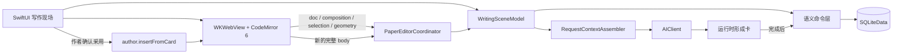
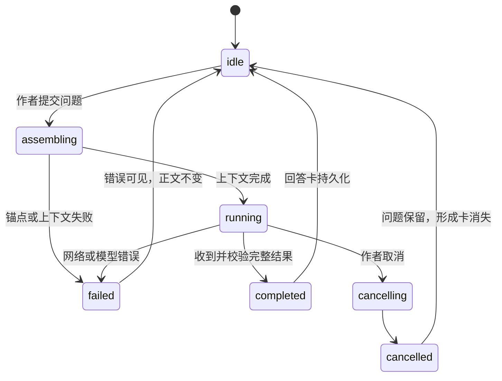

# 写作现场 · 可编码实现规格 v0.1

2026-09-19 · **从交互原型进入原生实现的工作文档。**

对应界面：[Mosaic 组件版 HTML](写作现场-Mosaic组件版.html)；产品边界见[产品构思](../写作现场%20·%20产品构思%20v0.2.md)，工程顺序见[底座与架构](../技术规划%20v0.1%20·%20底座与架构.md)，持久化见[数据模型](../技术规划%20v0.1%20·%20数据模型.md)，AI 权限见[AI 语义面](../技术规划%20v0.1%20·%20AI%20语义面.md)。

本文的目标是把界面图翻译成可以编码、测试和失败的实现规则。它覆盖从当前 S1–S4 spike 到 S6 第一个 AI 闭环。标记含义：

- **【地板】**：不可为了赶原型绕过。
- **【本轮】**：下一阶段应实现并验收。
- **【后置】**：结构要留得下，但现在不实现。
- **【待验证】**：不能从 HTML 外观直接推成产品定案。

---

## 1. 要实现的产品行为

作者打开一篇 Topic，看到正中的稿纸和上次留下的写作现场。作者继续写，在某一段起疑时，从段落侧边打开讨论或资料。AI 的回答、资料、反例和候选片段停在段落旁；只有作者明确选择内容与位置，文字才进入 Markdown 正文。

实现是否成功，看这些可观察行为：

1. 写正文时，注意力仍以稿纸为中心；旁注不会靠面积、饱和色或持续动画抢走视线。
2. 查资料或追问时，不必离开当前段，也不必在聊天历史里重新定位。
3. AI 请求由作者手势触发；输入、滚动、停顿和重新打开文稿都不会自动调用模型。
4. AI 产出先成为卡；正文没有任何 AI 可调用的写接口。
5. 作者采用前能看到将插入什么、插到哪里；取消后正文逐字不变。
6. 关闭并重开 App 后，正文、光标所在位置、展开卡和未解决问题恢复；运行中的请求不伪装成仍在运行。
7. 锚点失效时显示失效，不猜“最接近的段落”。

“作者是否真正理解”不作为验收项。产品只能让范围、来源、旧版本和采用动作可见，不能认证理解。

---

## 2. 本轮边界

### 2.1 做到第一个闭环

```text
打开 / 恢复 Topic
    ↓
写正文并安全保存
    ↓
选中或停在一个 Markdown block
    ↓
打开段旁讨论 / 资料
    ↓
作者明确发起一次 AI 请求
    ↓
回答卡停在旁边
    ↓
作者选择一部分、位置并插入
    ↓
继续写；卡与现场可恢复
```

第一轮原生实现至少覆盖：

- 单个 Topic 的完整写作现场。
- 源码模式 Markdown 编辑。
- 资料、待决、助手产出、张力四种旁注角色。
- 段落级 working set 与文本引用锚点。
- 一条连续段旁讨论的投影视图。
- 采用预览、插入、取消和安全撤销。
- scene 恢复。
- 一个模型提供者、一个请求队列、明确取消与错误状态。

### 2.2 本轮不做

- CloudKit、SyncEngine、多人协作。
- MCP 传输层或外部 agent。
- 跨 Topic 语义检索、embedding、Zotero。
- 无限画布、缩放、平移、鸟瞰和手工整理大图。
- 系统 Writing Tools Rewrite / Compose。
- 自动全文审阅、定时任务、文件观察者、输入触发的补全。
- 多模型编排和自治工具循环。
- Liquid Glass、卡片堆叠动画、Soundtrack；S6 闭环稳定后再接。
- iPad 竖屏的最终形态。竖屏先保证可用，不在这一轮定最终交互。

---

## 3. 当前代码基线与缺口

实际工程目前位于 `/Users/anderson/Developer/Swift/Mosaic/WriteField`，数据 target 位于 `MosaicPackage/Sources/WriteFieldData`。规划仍由本仓库负责；不要在规划仓库复制一份会分叉的 App 代码。

| 表面 | 当前已有 | 进入真实写作前的缺口 |
| --- | --- | --- |
| App 壳 | SwiftUI，iPadOS + macOS 原生 target | Topic 列表、稳定的 scene model、错误呈现 |
| 稿纸 | `PaperView` + CodeMirror 6 in `WKWebView` | 标题编辑、真实文稿加载、动态字体、采用命令 |
| 编辑桥 | `ready / composition / doc / layout`；Host 可 `setTheme / setDocument` | revision、防陈旧回调、插入与定位命令、结果回执 |
| IME | composition 期间不保存；结束后提交 | 500 字中文真机回归、生命周期中断、候选栏与撤销 |
| 保存 | JS 200ms 合并；Swift 1.5s debounce；失活 flush | 标题保存、失败提示、Topic 切换原子性 |
| 两侧卡 | 两张种子卡、跟随 caret paragraph、拖动与持久位置 | 多卡 working set、卡高度、折叠、讨论投影 |
| 线与端口 | 44pt 把手、拖线、typed edge、键盘 `⌘L` | 真正 anchorID、断锚、端口合并、iPad 手势验收 |
| 数据 | `topics / cards / edges` | `anchors / scenes`、可信来源回执、AI trigger |
| 恢复 | 正文数据库保存 | caret、openCardIDs、未决项、滚动定位 |
| AI | 无 | 作者触发、上下文组装、流式状态、回答卡、取消 |
| 采用 | HTML 已演示 | 原生选择面、CodeMirror transaction、回执与撤销保护 |

当前 `S1Demo` 会自动填充题目、正文和两张卡。进入真实文稿前应把 demo seed 只保留在 preview / debug fixture；live 数据库不能在空稿上自动写示例内容。

---

## 4. 总体架构



### 4.1 层次职责

**SwiftUI scene** 负责布局、焦点、手势、sheet、toast 与运行时视觉状态。它不直接拼 SQL，也不解析模型输出。

**Paper editor** 负责 Markdown 文本、选择、composition、编辑历史和可见 block 的几何。它不决定卡属于哪一段，也不写 cards / edges。

**Scene model** 组合当前 Topic、编辑器会话、解析后的锚点、working set、选中卡和正在运行的请求。采用 Observation；不引入 TCA。

**语义命令层** 是所有持久化写入的唯一入口。命令名称表达产品动作，例如 `question.create`、`edge.create`、`author.insertFromCard`，不模拟鼠标。

**AI client** 只接收组装好的只读上下文，返回结构化的候选卡。它拿不到数据库句柄，也拿不到正文写命令。

### 4.2 推荐的原生文件边界

名称可以调整，职责不要重新揉回一个巨型 `WritingSceneView`：

```text
WriteField/
  App/
    WriteFieldApp.swift
  Scene/
    WritingSceneView.swift
    WritingSceneModel.swift
    WritingSceneLayout.swift
    WorkingSetResolver.swift
    SurroundLayer.swift
    CircuitWireDrawing.swift
  Paper/
    PaperView.swift
    PaperSession.swift
    PaperEditorView.swift
    PaperEditorBridge.swift
  Annotations/
    AnnotationCardView.swift
    DiscussionCardView.swift
    SourceCardView.swift
    TensionCardView.swift
    AnnotationRole.swift
  Adoption/
    AdoptionSheet.swift
    AdoptionCoordinator.swift
  AI/
    AIClient.swift
    AIRequestCoordinator.swift
    RequestContextAssembler.swift
    AIRequestReceipt.swift
  Theme/
    WriteFieldTheme.swift
    WriteFieldControlTokens.swift

WriteFieldData/
  Topic.swift
  Anchor.swift
  Card.swift
  Edge.swift
  Scene.swift
  Provenance.swift
  AuthorCommands.swift
  AICommands.swift
  Schema.swift
```

`WriteFieldControlTokens` 可以使用 Mosaic 的数值和状态语言，但应是 SwiftUI / Foundation 本地实现。不要导入 `MosaicComponents` 的 AppKit view。

---

## 5. 状态模型

### 5.1 持久状态

| 对象 | 存什么 | 不存什么 |
| --- | --- | --- |
| `Topic` | 标题、Markdown body、时间 | 编辑器实例、第二份正文 |
| `Anchor` | TextQuoteSelector JSON | HTML 节点、CodeMirror 对象 |
| `Card` | 类型、正文、状态、来源、父卡、anchor、相对位置 | hover、流式 token |
| `Edge` | 类型与两个 endpoint | 屏幕折线路径 |
| `Scene` | caretAnchor、openCardIDs、unresolvedCardIDs、lastOpenedAt | 运行请求、hover、undo 栈、viewport zoom |
| App setting | 整 App 的 soundtrack 绑定、主题覆盖 | Topic 专属播放器实例 |

### 5.2 运行时状态

建议由一个 `@MainActor @Observable` scene model 持有：

```swift
@Observable
@MainActor
final class WritingSceneModel {
  var topicID: Topic.ID?
  var editor = PaperSession()
  var activeAnchorID: Anchor.ID?
  var selectedCardID: Card.ID?
  var openCardIDs: Set<Card.ID> = []
  var focusedSurface: FocusedSurface = .paper
  var sidePull: SidePullState?
  var cardMove: CardMoveState?
  var request: AIRequestState = .idle
  var presentedSheet: SheetDestination?
  var toast: ToastState?
}
```

以下状态禁止持久化：

- `.assembling / .streaming / .cancelling` 的 AI 请求。
- 当前 hover、drop target、焦点环。
- 拖动过程中的每一帧。
- 采用 sheet 的临时勾选。
- 跨启动 undo / redo。

### 5.3 AI 请求状态机



运行中只让正在形成的卡或侧边 orb 发光。纸、选区和整个段落不发光。

---

## 6. 数据与迁移

### 6.1 `topics`

当前表可以继续使用。正文唯一事实源是 `topics.body`；`.md` 是可重建镜像 / 导出。标题也应通过语义命令保存，不能只停在 SwiftUI local state。

### 6.2 `anchors`

【本轮】在真实卡与讨论前落表：

```sql
CREATE TABLE anchors (
  id        TEXT PRIMARY KEY NOT NULL ON CONFLICT REPLACE DEFAULT (uuid()),
  topicID   TEXT NOT NULL REFERENCES topics(id) ON DELETE CASCADE,
  selector  TEXT NOT NULL DEFAULT '{}',
  createdAt TEXT NOT NULL
) STRICT;
```

Selector 至少包含：

```json
{
  "exact": "作者选中或所在 block 的稳定文字",
  "prefix": "前 32 字",
  "suffix": "后 32 字",
  "hint": {
    "blockOrdinal": 4,
    "headingPath": ["三、正文"],
    "docOffset": 3187,
    "line": 96,
    "column": 5
  }
}
```

Swift 使用 `swift-markdown` 解析 block，并按以下顺序解析：

1. 先在 hint 附近匹配完整 `exact`。
2. 再全文匹配 `exact`。
3. 多处命中时用 prefix / suffix 消歧。
4. 无唯一命中则返回 `.broken`，不吸附到相似文本。

编辑器传出的 offset 与 geometry 是定位提示和当前屏幕投影；持久正确性来自 selector。

### 6.3 `cards`

沿用现有四态：`draft → ready → used`，以及 `discarded`。`parentCardID` 保持“回答属于哪个问题”的硬关系；多来源使用 `derived` edges。

S6 前补齐独立 `trigger` JSON。它与 provenance 含义不同：provenance 说明内容从哪里来，trigger 说明是哪次作者动作让它产生。

```sql
ALTER TABLE cards ADD COLUMN trigger TEXT NOT NULL DEFAULT '{}';
```

示例：

```json
{
  "id": "ask-uuid",
  "kind": "paragraphAsk",
  "createdAt": "2026-09-19T09:30:00Z",
  "anchorID": "anchor-uuid",
  "question": "都是逐项处理，差别在哪？",
  "contextMode": "progressive"
}
```

作者手写卡的 `trigger` 可以是 `{ "kind": "author" }`。AI 产出不得为空对象。

### 6.4 `edges`

当前临时 `paragraph:<topic>:<index>` 只能用于 S4 spike。真实实现中，block endpoint 应指向 `anchorID`，避免段落序号变化后误连。

端点约定建议收成：

- block / text endpoint 的 `sourceID` 或 `targetID` = anchor UUID。
- card endpoint = card UUID。
- `reference / basis / rebuttal / open / derived` 保持现有类型。
- 删除卡可级联删 edge；废弃卡不删除，因此边继续存在。

屏幕折线路径每帧计算，不入库。

### 6.5 `scenes`

【本轮，S5 前置】按现有数据文档落表。写入时机：

- caret 稳定 300–500ms 后更新 selector。
- 打开 / 收起卡立即更新 ID 集合。
- Topic 切换、scene phase 离开 active 时 flush。
- 不记录正文每次滚动 offset；恢复时解析 caretAnchor，再调用 editor scroll。

### 6.6 provenance

只允许：

- `clipped`：作者真实剪取，保存 URL、标题、原句和时间。
- `retrieved`：应用真实执行检索，保存 query、结果 URL、标题、原始 snippet、引擎和时间。
- `asserted`：模型生成但没有外部来源，保存 model、version、askedAt。

`asserted` 可以成为普通卡，不能成为 footnote 或 reference edge 的依据。来源结构只证明获取路径，不证明内容为真。

---

## 7. 编辑器与桥接

### 7.1 正文生命周期

1. Topic 打开后，Host 调用 `setDocument(body, restoreSelector)`。
2. CodeMirror 使用 `Transaction.addToHistory.of(false)` 加载，不污染作者撤销栈。
3. 输入时 JS 合并频繁 doc event；composition 期间不发送 body。
4. composition 结束后双 `requestAnimationFrame`，再发最终 body 与 layout。
5. Swift 收到 body 后 1.5s debounce 写 SQLite；离开 active / 切 Topic / 拆 view 时 flush。
6. 写入失败保留 pending body 并显示可恢复提示；不能把“保存失败”静默显示成已保存。

### 7.2 桥消息

现有消息保留，并增加单调 revision：

```text
JS → Swift
ready
composition(composing)
doc(body, revision, composing=false)
layout(selection, caretBlock, revision)
commandResult(id, success, range?, reason?)

Swift → JS
setTheme(tokens)
setDocument(body, restoreSelector)
focusAnchor(selector)
insertFromCard(commandID, markdown, target)
undoAuthorInsert(commandID)
```

Swift 丢弃小于当前 document revision 的 layout 回调，避免滚动或 reflow 后旧几何把卡拉回旧位置。

### 7.3 选择与当前 block

JS 可以快速报告：

- `from / to`。
- `exact / prefix / suffix`。
- 当前 block 的屏幕 rect。
- 行列与 doc offset hint。

Swift 负责把它解析为真实 Anchor。视图可以先用 JS rect 画当帧连线；持久化必须等待 resolver 得出唯一结果。

### 7.4 作者采用

AI 与数据层不能调用 editor 插入。唯一入口由 UI 的作者事件创建：

```swift
struct AuthorInsertCommand {
  let cardID: Card.ID
  let markdown: String
  let target: InsertTarget
  let expectedRevision: Int
}
```

执行顺序：

1. 打开采用 sheet 时冻结候选文本、目标 selector 和 document revision。
2. 作者勾选内容与位置。
3. 确认时重新检查 revision 与 selector。
4. 若目标已变化，停止并要求重选；不寻找“最近位置”。
5. CodeMirror 用一个 transaction 插入，进入正常 history。
6. JS 回传实际 range；Swift 再把卡设为 `used`，记录运行时 undo receipt。
7. 显示含“撤销”的 toast。

撤销只在插入 range 仍与 receipt 文本一致时执行。作者已经改过该文字时，保留正文并提示手动处理。其它段落的后续编辑绝不能被快照回滚。

---

## 8. 写作现场布局

### 8.1 宽布局

```text
┌──────────────────────────────────────────────────────────┐
│ 文稿名 / 保存状态                         资料 只看稿 导出 │
├──────────────────────────────────────────────────────────┤
│ 左侧 working set   ┌──────────稿纸──────────┐ 右侧讨论     │
│ 资料 / 作者待决     │ 标题                    │ 回答 / 张力   │
│                    │ 当前 block         ●────│              │
│                    │                        │              │
│                    └────────────────────────┘              │
└──────────────────────────────────────────────────────────┘
```

初始几何可沿用现有 `WritingSceneLayout`：

- paper width：`min(640, sceneWidth × 0.52)`。
- card width：`clamp(168, sceneWidth × 0.17, 220)`；讨论卡可在 Mac 放宽到约 300。
- card gutter：`max(16, sceneWidth × 0.03)`。
- 稿纸只有纵向 scroll；背景没有 pan / zoom。
- 卡的 home Y 取 anchor block 的 midY，再做屏幕边界 clamp。
- 手动 `x/y` 是相对 home origin 的偏移；拖动结束才写库。

### 8.2 working set

当前 block 的卡默认展开。其它可见 block 只在侧边合并成一个 44pt 端口；滚出稿纸可见区后，卡收起。

排序建议：

1. 作者当前打开的卡。
2. 未解决的待决卡。
3. 当前 block 的资料与助手产出。
4. `used / discarded` 折叠为较矮记录。

一侧卡片发生碰撞时，做确定性的纵向排布，不引入自由画布。作者拖过的卡尽量保留相对偏移；必要 clamp 不改写其存储值，除非作者结束拖动。

### 8.3 较窄布局

- 宽度不足以容纳三列时，先收起左侧资料区；顶栏“资料”仍可打开同一内容。
- 保留稿纸与当前讨论，不把稿纸压成 IDE 窄栏。
- 再窄时，讨论在稿后或 sheet 中展开；段旁按钮与锚点引用负责往返。
- 适配看可用宽度，不以“Mac / iPad”硬编码两套产品。

iPad 横是本轮真机验收面。iPad 竖屏只做安全降级，最终形态继续【待验证】。

---

## 9. UI 组件规格

### 9.1 表面层级

- 桌面：退后的石色；深色系统外观可把桌面与顶栏变暗。
- 稿纸：始终为适合长文的暖白 `#FFFEFA`，保持视觉中心。
- 旁注卡：同一暖白家族，1px 低对比 hairline。
- 控件 track：Mosaic slate 100；浮层 / sheet 用 10 / 14 圆角区分层级。
- 不把整张旁注填成角色色，不把稿纸做成玻璃。

### 9.2 Mosaic 组件语言

在 SwiftUI 中重建这些 token：

| Token | 值 | 用途 |
| --- | --- | --- |
| radius | `4 / 6 / 10 / 14` | 嵌套、字段、卡、sheet / 浮动按钮 |
| spacing | `4 / 8 / 12 / 16` | 组件内部与相邻分组 |
| type | `11 / 12 / 13 / 16 / 22 / 28` | caption、control、body、title、display |
| control height | 可见 28；hit area ≥44 | Mac 紧凑观感、iPad 可触控 |
| hover / pressed | accent 12% / 18% | 指针与按压反馈 |
| accent | `#2D74CC` 起步，最终走系统可访问色 | 主动作、焦点、选中 |

Mosaic 原始 24% selected wash 在写作现场过重。当前方案：卡面保持暖白；当前讨论用 1px、约 38% accent 的描边，不加整面蓝底和外圈。键盘 focus 仍使用清楚的 2px focus ring。

### 9.3 旁注颜色

| 角色 | 基础色 | 显示方式 |
| --- | --- | --- |
| 资料 | `#007AFF` | book / link 图标、资料线、点 |
| 待决 | `#C47B17` | question / note 图标、待决线、点 |
| 助手产出 | `#5B7C8A` | spark / chat 图标、回答线、形成 orb |
| 张力 | `#C4474A` | opposing arrows 图标、rebuttal 线、点 |

显示时约 58%–62% 强度起步。标题文字用中性 ink / secondary label；角色必须同时写成文字。可选的 2px 标记应短、淡，并与图标对齐，不能成为贯穿整卡的后台管理系统色条。

### 9.4 旁注卡

共同结构：

```text
[角色图标] 角色文字 / 状态                         [更多]
标题
正文或摘要
来源 / 版本 / 本次范围
局部动作
```

卡面状态：

- normal：暖白、hairline、轻 shadow。
- hover：只抬高操作 affordance，不给整卡铺色。
- selected：轻 accent 描边；role 仍由图标与线表示。
- focus-visible：外部 2px 系统强调环。
- loading：形成中的卡或 orb 发光；正文不发光。
- broken anchor：断线图标 + “原位置已变化”，提供重新指定。
- discarded：降低层级但保持可恢复与来源关系。

### 9.5 讨论卡

讨论卡是 card graph 的投影，不另存一份聊天正文：

- 根是 `question` card。
- 回答是 `answer` card，`parentCardID = question.id`。
- 追问仍是新的 question；它与上一回答用 `derived` edge 连接，并在同一投影视图里顺序显示。
- 原始 card 与 edge 保留；UI 可以把它们排成一条连续对话。

卡头显示“助手产出 · 段旁讨论”、标题、收起按钮。其下显示目标原句；点原句把焦点还给 editor 并滚到 anchor。请求范围、来源与历史快照收进可展开 receipt，不常驻压住正文。

讨论内容过长时，turn list 可以局部滚动，但卡本身没有独立相机、缩放或空间坐标系。拖卡只从 header / drag handle 开始，避免与文字选择和内部滚动争手势。

### 9.6 资料卡

常态显示标题、来源域名 / 版本和短摘录。打开 sheet 后显示：

- 原始选取文本。
- URL / 文件来源。
- 获取时间与获取方式。
- “打开原文”与“回到写作”。

参考页仍是 live Web；只有作者剪取后的文字才能进入 AI 上下文或 footnote。刷新是作者按钮，不是后台定时器。

### 9.7 张力卡

“张力”表达反例、反驳和冲突观点，不表达真假判决。默认可折叠为一行，展开后可“在讨论中对照这一点”，其作用是把明确问题放进 composer，不自动发请求。

### 9.8 toolbar、toast 与 sheet

- Toolbar 只保留文稿身份、保存状态、撤销采用、资料、只看稿、导出。
- “只看稿”隐藏卡与线，但端口或恢复入口仍可到达；退出时恢复此前 openCardIDs。
- Toast 高 40–44pt、radius 10，可带一个动作。重要失败不能自动消失。
- Sheet radius 14，标题与解释简短；采用、资料、作者笔记分别是独立短任务，不叠 sheet。

---

## 10. 关键交互流程

### 10.1 写作与保存

1. 作者输入。
2. marked text 只存在于 editor。
3. composition end 后发送完整 body。
4. 保存状态依次显示“正在编辑 / 正在保存 / 已保存 / 保存失败”。
5. 保存不触发 AI、锚点卡创建或自动审阅。

### 10.2 打开当前段讨论

1. caret 进入非空 block，scene model 得到临时 geometry。
2. AnchorResolver 找到或创建 selector。
3. 点击 44pt 侧边按钮，展开此 anchor 的 working set。
4. composer 聚焦，但不改 editor selection。
5. 收起后显示可恢复入口；重新打开保留未发送草稿。

Mac hover 只披露按钮。iPad 无 hover，当前 block 的入口始终可触控。

### 10.3 作者发起 AI 请求

1. 作者填写问题。
2. 作者确认本次范围：当前段；可显式附资料或选择全文 / 策展。
3. UI 创建 `AuthorTrigger` 和 question card；问题先持久化。
4. assembler 读取当前 revision 下的范围，生成 receipt。
5. 运行中的形成卡出现；作者可继续写正文。
6. 完整、校验通过的输出写 answer card 与 edges。
7. 旧正文后来变化时，回答显示“基于发送时版本”；不自动重问。

切换去另一段并明确开始新讨论时，可以取消旧运行任务；普通打字和滚动不取消。

### 10.4 取消与失败

- 取消：question 保留，forming card 消失，写一条运行时状态或简短系统记录；不保存半截回答。
- 网络错误：卡上显示可重试，正文不变。
- 输出结构无效：不落成 ready card；保留错误与 request ID 供诊断。
- 模型拒绝 / 超预算：显示具体原因与实际读取范围。
- App 退出：取消请求；重开后不能显示“仍在生成”。

### 10.5 选择采用

1. 从回答卡点“选择采用…”。
2. Sheet 展示候选块、来源状态、插入位置和 Markdown 预览。
3. 默认不预选全部长回答；短的单候选可以预选一项，但仍需作者确认。
4. “暂时留在旁边”关闭 sheet，零正文变化。
5. “插入正文”执行 §7.4 的 author command。
6. 成功后回到稿纸、定位新内容并给可撤销 toast。

不得用“接受 AI 修改”“一键优化”之类文案。动作对象是明确的候选块。

### 10.6 锚点失效

1. Resolver 返回 broken。
2. 原线变为断开状态，卡保留原文与历史关系。
3. 卡显示“原位置已变化”。
4. 作者选择“重新指定”，回纸选新位置后确认。
5. 只有确认后更新 anchor；取消保持 broken。

禁止自动挂到最近段、同标题段或相似句。

### 10.7 恢复现场

1. 读取 Scene。
2. 加载 body，不进 undo history。
3. 解析 caretAnchor；成功则 editor 滚到该处，失败则停在文稿开头并提示。
4. 恢复 openCardIDs；已经不存在的 ID 被过滤并记录诊断。
5. 重新计算 working set 与几何。
6. request 状态始终从 idle 开始。

---

## 11. AI 实现边界

### 11.1 可调用命令

AI 只通过以下语义动作产出数据：

- `question.create`
- `answer.create`
- `annotation.create`
- `clip.create`（只能消费可信剪取 / 检索回执）
- `snippet.create`
- `edge.create`
- `card.setState`

不存在 `body.write / insert / replace / rewrite`。`author.insertFromCard` 不注册给模型。

### 11.2 请求拼装

默认 progressive：

```text
可选 stance
+ 文章 outline
+ 当前 anchor block 与邻段
+ 此 anchor 已挂卡与边
+ 本次明确附加的 source cards
+ 作者问题与 trigger
```

Request receipt 至少记录：

- request ID 与 trigger ID。
- topicID、anchorID、body revision / hash。
- contextMode。
- 实际包含的 anchor / card IDs。
- 是否带 stance。
- 是否截断以及截断原因。
- model 与时间。

Receipt 可存入 answer card 的 provenance / audit JSON；不要复制第二份全文。

### 11.3 输出校验

模型输出先解码为候选 DTO，再由应用转成命令：

- 数量服从 trigger 上限。
- 所有 AI card 有 trigger、model、provenance。
- answer 必须有 questionCardID。
- asserted 不能伪装成 clip / retrieved。
- 未知 anchor / sourceCardID 使该候选失败，不自动删字段后继续。
- 任一候选失败不应让已成功写入的部分处于半事务状态；一次响应使用数据库 transaction。

### 11.4 流式显示

流式 token 只写内存中的 `FormingCardState`。完整输出完成、结构校验与数据库 transaction 成功后，才切换为持久 card。这样取消与崩溃不会留下假装完整的半张回答。

---

## 12. 手势、焦点与平台行为

### 12.1 iPad

- 任何主要 hit target ≥44×44pt。
- 侧边 handle 常在；不能依赖 hover。
- 开始 side pull 后临时禁用 paper scroll；结束 / 取消立即恢复。
- 卡片正文可滚时，拖卡只在 header handle 生效。
- 键盘出现后，不把 composer 顶出可视区；paper 与讨论之间切换有明确焦点状态。
- 支持外接键盘：`⌘L` 连接所选卡，`⌘Return` 发送问题，`Esc` 取消 / 关闭最上层任务。

### 12.2 macOS

- hover 可以显示次要按钮，但不能改变信息是否可达。
- 28pt 视觉控件放在至少 44pt 的可点击布局区域；紧凑外观不缩小可访问目标。
- Tab / Shift-Tab 有稳定顺序：toolbar → paper → 当前段端口 → 展开卡 → composer。
- 打开资料或讨论不无故偷走正在进行的正文输入；作者明确点击输入区才转移键盘焦点。

### 12.3 焦点模式

进入时保存当前展开集合到运行时；隐藏卡与线，稿纸居中。退出时恢复集合并重新计算 anchor 几何。Topic 切换或 App 重启不把“焦点模式”误当作未解决问题；是否持久化该偏好【待验证】。

---

## 13. 可访问性

- 每张卡暴露角色、标题、状态与锚点状态，例如“资料，Data.Traversable，已连接当前段”。
- 颜色不是唯一信息：始终有 SF Symbol 与文字标签。
- 线本身不作为唯一可操作控件；有按钮、菜单和键盘等价。
- 动态字体：SwiftUI 文本使用语义 font；WKWebView 从 content size category 接收字号 token。稿纸正文基准 17px，但不锁死缩放。
- Reduce Motion：forming card 直接淡入或使用静态 progress，不做循环光效；scroll 定位不用平滑动画。
- Increase Contrast：提高 hairline 与 secondary text，不提高角色色面积。
- VoiceOver 打开卡后，焦点进入卡标题；关闭 sheet 后回原触发按钮。
- 错误与保存失败用可读文本，不只用红色或 toast 自动消失。

---

## 14. 失败姿态

| 失败 | UI | 数据行为 |
| --- | --- | --- |
| SQLite 写失败 | 保存状态明确失败；允许重试 / 导出 | pending body 不丢 |
| WKWebView process 终止 | 重新载入 editor，恢复已持久 body | 最多有限重试；不循环 |
| IME 未结束时退后台 | 不保存 marked text；恢复时用最后 committed body | scene flush 跳过 composing |
| Anchor broken | 断锚卡 + 重新指定 | 不改 anchor |
| AI 无网 / 超时 | 形成卡转错误，可重试 | question 保留，无 answer |
| AI 取消 | 明确“已取消” | 不保存 partial answer |
| Context 截断 | receipt 可见 | 记录 truncated，不装作读完 |
| 来源页不可达 | 显示已保存摘录与当前不可达 | 不把 clipped 改成 asserted |
| 采用位置变化 | sheet 内报错，要求重选 | 正文不变，card 仍 ready |
| 撤销目标已被作者修改 | 保留作者文字 | 不执行范围删除 |

---

## 15. 测试与验收

### 15.1 数据与纯逻辑单测

- AnchorResolver：唯一命中、重复句消歧、改字、删除、中文标点、代码块、列表、broken 不猜。
- BodySaveGate：composition、相同 body、flush。
- WorkingSetResolver：当前段、滚出屏幕、used / discarded、openCardIDs。
- SurroundPlacement：纸外 clamp、端口仍落在卡侧边、拖动偏移。
- AuthorInsert：revision 匹配、目标变化拒绝、部分采用、其它编辑不被撤销。
- ProvenanceGate：asserted 禁止 footnote / reference。
- RequestContextAssembler：范围、截断、Topic 隔离、receipt。
- AICommandValidator：trigger、parent question、产物上限、transaction 原子性。

### 15.2 编辑器集成测试

- 中文 IME 连续 500 字：候选、撤回、标点、换行、undo / redo。
- composition 中切后台与恢复。
- Host setDocument 不进入 history。
- insertFromCard 是一个 history transaction。
- stale revision 的 layout / command result 被忽略。
- WKWebView process 重启后恢复 committed body。

### 15.3 UI / 真机测试

- iPad 11 英寸横屏：纸保持中心；左右卡可点；手指可拉线。
- 纸滚动与卡拖动不抢 pan。
- 当前 block 出屏后卡收起；回来后恢复。
- 三列、两列、紧凑三种宽度不把稿纸压坏。
- 外接键盘与 VoiceOver 能完成提问、取消、采用。
- 深色系统外观下桌面 / chrome 退暗，稿纸和旁注仍清楚但不刺眼。
- 角色颜色减弱后，作者能凭文字和图标识别；旁注不抢稿纸。

### 15.4 第一个 AI 闭环验收

1. 对当前段提问。
2. 形成状态只出现在卡侧。
3. 继续改正文不触发第二次请求。
4. 回答落卡，记录 trigger 与范围 receipt。
5. 修改原段后，回答显示基于旧版本。
6. 打开采用 sheet，取消时 body 完全相同。
7. 确认后只有所选内容进入指定位置。
8. 安全撤销不覆盖其它新编辑。
9. 重启后回答卡和现场恢复，运行状态不恢复。

---

## 16. 实现顺序

### M0：整理当前 spike

- 把 `S1Demo` 限制在 preview / debug fixture。
- 拆出 `WritingSceneModel`，避免 `WritingSceneView` 继续承载数据库、几何、手势和命令。
- 为 editor bridge 加 revision 与结构化日志；日志不打印正文。
- 把当前 HTML 的 token 落入 SwiftUI theme；不做 AI。

通过条件：现有 S1–S4 行为不退化，两平台编译，中文 IME 基线通过。

### M1：真实锚点与多卡 working set

- 落 `anchors` migration 与 Swift resolver。
- `edges` 从 paragraph index 过渡到 anchor UUID。
- 当前段多卡、端口合并、broken anchor UI。
- 卡片角色、轻量选中态和适配布局。

通过条件：改字、移动段落后仍能唯一恢复；不能唯一恢复时明确 broken。

### M2：现场恢复（S5）

- 落 `scenes`。
- 恢复 caret anchor、open cards、unresolved cards。
- lifecycle flush 与错误状态。

通过条件：打字、挪卡、展开讨论、关 App、再开后恢复；没有假的运行请求。

### M3：讨论与采用，不接真实模型

- 用 fixture / local fake 跑完整 question → answer card graph。
- 实现 DiscussionCard projection。
- 实现 AdoptionSheet、editor insert command、toast undo。
- 验证权限边界与失败姿态。

通过条件：HTML 的 75 项关键行为在原生路径有对应测试；正文只有 author command 能变。

### M4：一个 AI 动作（S6）

- 加 `trigger` migration。
- 实现 RequestContextAssembler、receipt、AIClient protocol、请求协调器。
- 流式形成卡、取消、错误与完整结果 transaction。
- 只接一个“就当前段提问”动作；其它 AI 入口后置。

通过条件：满足 §15.4，并开始真实写作记录。

### M5：两周真实使用后再决定

- 资料参考页是否值得内嵌。
- 策展 / full 是否真的需要常驻入口。
- iPad 竖屏用 sheet、稿后卡还是别的形态。
- 一段多卡是否需要叠放。
- 24% Mosaic selected wash 已被试看否决，不回滚到重色方案。

---

## 17. 编码检查表

每个 PR 自查：

- [ ] 是否新增了 AI 可调用的正文写路径？如果是，删除。
- [ ] 是否可能在输入、计时、恢复或后台自动调用 AI？如果是，删除。
- [ ] composition 期间是否可能保存 marked text？
- [ ] Anchor 失败时是否会猜一个替代位置？
- [ ] `.md` 是否仍为干净 Markdown，没有 block ID 或 HTML 私有标记？
- [ ] asserted 内容是否可能成为 footnote / reference？
- [ ] 状态色是否扩大成卡片铺底？
- [ ] iPad 的入口是否依赖 hover 或小于 44pt？
- [ ] 是否引入了第二套 pan / zoom / viewport？
- [ ] 是否在拖动每一帧写 SQLite？
- [ ] 采用取消后 body 是否逐字相同？
- [ ] 恢复后是否会谎报一个仍在运行的请求？
- [ ] 变更是否在 iPadOS 与 macOS 两个 scheme 都能编译？

---

## 18. 真实使用记录

实现达到 S6 后，每次真实写作只记录：

- 我在什么时候离开正文，为什么？
- 哪个上下文如果留在段旁，可以省掉一次切换？
- 哪张卡创建后再也没看？
- 哪张卡让第二天恢复了思路？
- 哪个动作像是在“为了使用产品而使用产品”？

这些记录决定下一阶段。点击率、卡片数量和模型调用次数只能辅助诊断，不能替代写作现场的实际体验。

---

## 19. 尚未定案，编码时不要顺手决定

1. 空稿“关于这篇”的持久归属。当前 anchor 模型要求文本锚点；若要 Topic 级讨论，应正式增加 Topic anchor 类型，不能用空 UUID 或第一段冒充。
2. iPad 竖屏最终形态。
3. 一段同时展开多少张卡，以及是否叠放。
4. 资料是否固定左、讨论是否固定右。
5. 部分采用后 card 是否立刻变 `used`。
6. `curated / full` 的最终 UI 与 sticky 行为。
7. 参考页卡是否会变成小浏览器工作台。
8. 深色外观是否长期坚持白纸；当前实现按已认可原型与仓库当前约束使用白纸，仍应在真机长时间写作后复核亮度。

这些项目可以在代码里留扩展点，但不应提前加设置、表列或复杂抽象。
